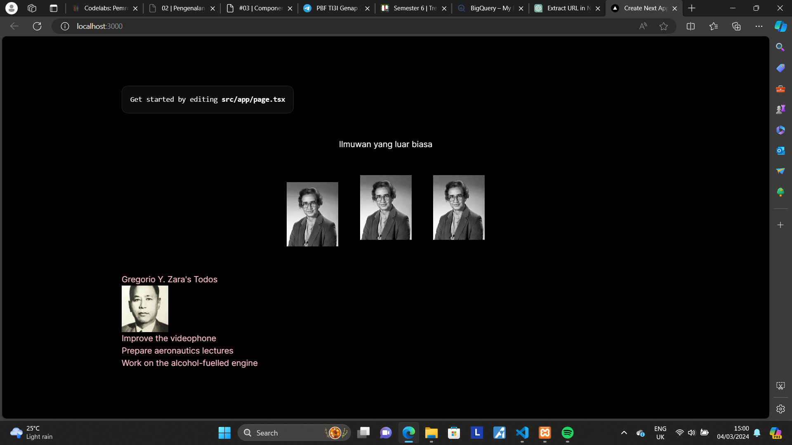
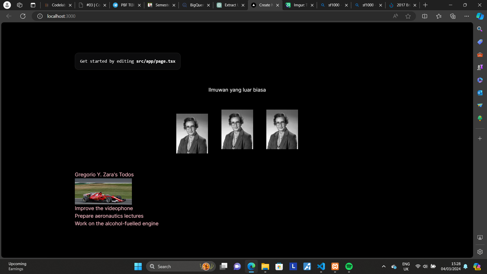
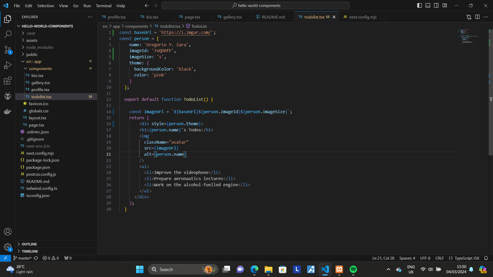

This is a [Next.js](https://nextjs.org/) project bootstrapped with [`create-next-app`](https://github.com/vercel/next.js/tree/canary/packages/create-next-app).

## Getting Started

First, run the development server:

```bash
npm run dev
# or
yarn dev
# or
pnpm dev
# or
bun dev
```

Open [http://localhost:3000](http://localhost:3000) with your browser to see the result.

## Practicum Report

|  | Framework Based Programming 2024 |
|--|--|
| NIM |  2141720067|
| Nama |  Saefulloh Fatah Putra Kyranna |
| Kelas | TI - 3I |

## Answer of Question no. 1

Output: 


There were some error at the beginning, such as not displaying the profile, however we can fix the error by editing the next.config.mjs file to include the image domain. 

Error code: 


Fix that include the image: 

``````
const nextConfig = {
    reactStrictMode: true,
    images : {
        domains : ['i.imgur.com']
    }
};


export default nextConfig;
``````

## Answer of Question no. 2

Output: 


The page loads as usual with assets from Gallery component being displayed on the screen. This is because inside the page.tsx there is a function that calls the component from the component folder. 

Source code on page.tsx

``````
import Image from "next/image";
import Profile from "./components/profile";
import { Gallery } from "./components/gallery";
import Bio from "./components/bio";
import TodoList from "./components/todolist";

export default function Home() {
  return (
    <main className="flex min-h-screen flex-col items-center justify-between p-24">
      <div className="z-10 max-w-5xl w-full items-center justify-between font-mono text-sm lg:flex">
        <p className="fixed left-0 top-0 flex w-full justify-center border-b border-gray-300 bg-gradient-to-b from-zinc-200 pb-6 pt-8 backdrop-blur-2xl dark:border-neutral-800 dark:bg-zinc-800/30 dark:from-inherit lg:static lg:w-auto  lg:rounded-xl lg:border lg:bg-gray-200 lg:p-4 lg:dark:bg-zinc-800/30">
          Get started by editing&nbsp;
          <code className="font-mono font-bold">src/app/page.tsx</code>
        </p>
        <div className="fixed bottom-0 left-0 flex h-48 w-full items-end justify-center bg-gradient-to-t from-white via-white dark:from-black dark:via-black lg:static lg:h-auto lg:w-auto lg:bg-none">
          
        </div>
      </div>

      <p className="text-center lg:max">
        Ilmuwan yang luar biasa
      </p>
      <div className="relative flex lg:grid-cols-4">
          <Gallery />
      </div>

      <div className="mb-32 lg:max-w-5xl lg:w-full lg:mb-0 lg:grid-cols-4 lg:text-left">
        
      </div>
    </main>
  );
}
``````

## Answer of Question no. 3

Fixed code using converter: 

``````
export default function Bio() {
    return (
      <>
      {/* Hello world */}
      <div className="intro">
        <h1>Selamat datang di website saya</h1>
      </div>
      <p className="summary">
        Anda dapat membaca uneg-unegku disini.
        <br />
        <br />
        <b>
          Juga ada <i>foto</i>
        </b>{" "}
        ilmuwan!
      </p>
    </>

    );
}
``````

Here, the code has "ClassName" instead of "Class" because JSX doesn't recognize "Class" as a property. 

Output: 


## Answer of Question no. 4

Problematic code: 


There is a mistake on h1 tag in "person" curly bracket. It was supposed to refer to the person object, but it didn't specify person's attribute. Therefore we can fix it with assigning an attribute to the person. 

Fixed code: 

``````
const person = {
    name: 'Gregorio Y. Zara',
    theme: {
      backgroundColor: 'black',
      color: 'pink'
    }
  };
  
  export default function TodoList() {
    return (
        <div style={person.theme}>
        <h1>{person.name}'s Todos</h1>
        
        <ul>
          <li>Improve the videophone</li>
          <li>Prepare aeronautics lectures</li>
          <li>Work on the alcohol-fuelled engine</li>
        </ul>
      </div>
    );
  }
``````

## Answer of Question no. 5

URL extraction from todolist: 

``````
const person = {
    name: 'Gregorio Y. Zara',
    theme: {
      backgroundColor: 'black',
      color: 'pink'
    }
  };
  
  export default function TodoList() {
    const imageUrl = 'https://i.imgur.com/7vQD0fP';
    return (
        <div style={person.theme}>
        <h1>{person.name}'s Todos</h1>
        
        <ul>
          <li>Improve the videophone</li>
          <li>Prepare aeronautics lectures</li>
          <li>Work on the alcohol-fuelled engine</li>
        </ul>
      </div>
    );
  }
``````

Here, we extract the URL from src so that the image can be modified to any image according to the required image. We will demonstrate it with modifying the imageUrl constant with other image. 

Original output: 



Link to image: https://upload.wikimedia.org/wikipedia/commons/thumb/f/f0/2017_British_GP_-_Vettel%27s_Ferrari_SF70H_with_%27Shield%27_system_%282%29.jpg/180px-2017_British_GP_-_Vettel%27s_Ferrari_SF70H_with_%27Shield%27_system_%282%29.jpg

Modified output: 



Seperti yang bisa Anda lihat, gambar di web berubah menjadi gambar yang sesuai dengan link diatas. Hal ini sangat berguna jika ingin mengganti gambar sesuai keinginan tanpa harus mengubah link di dalam style gambar. 

## Answer of Question no. 6

Fixed code: 

