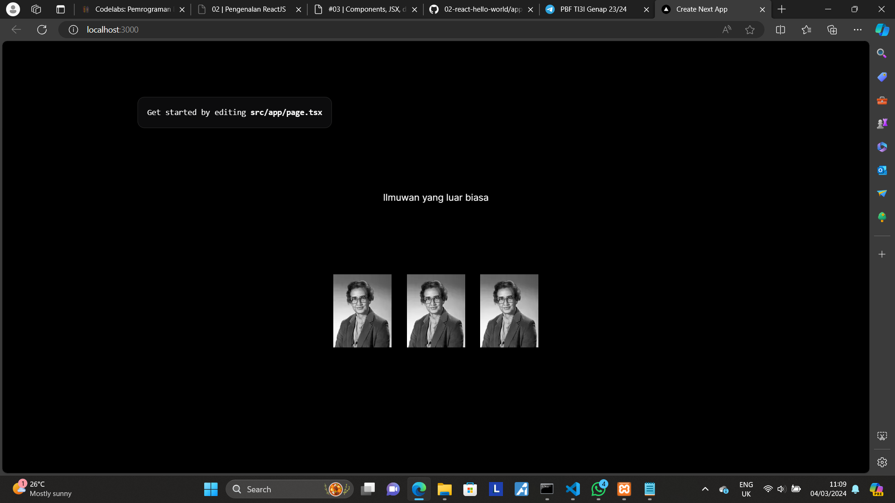
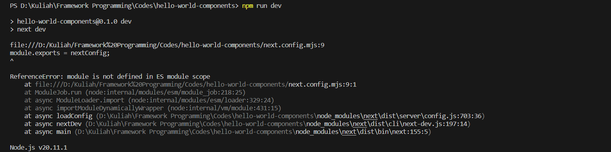
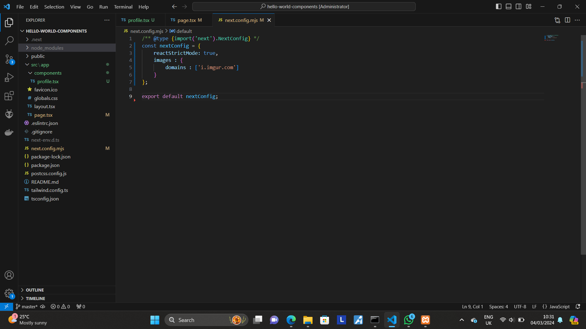
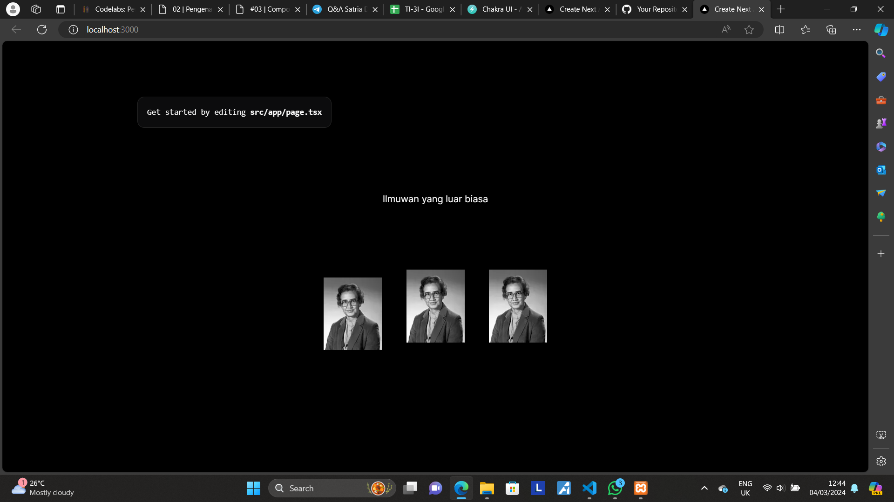
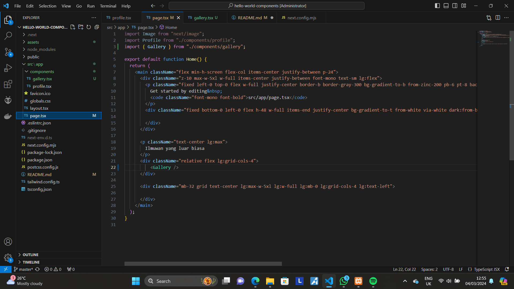
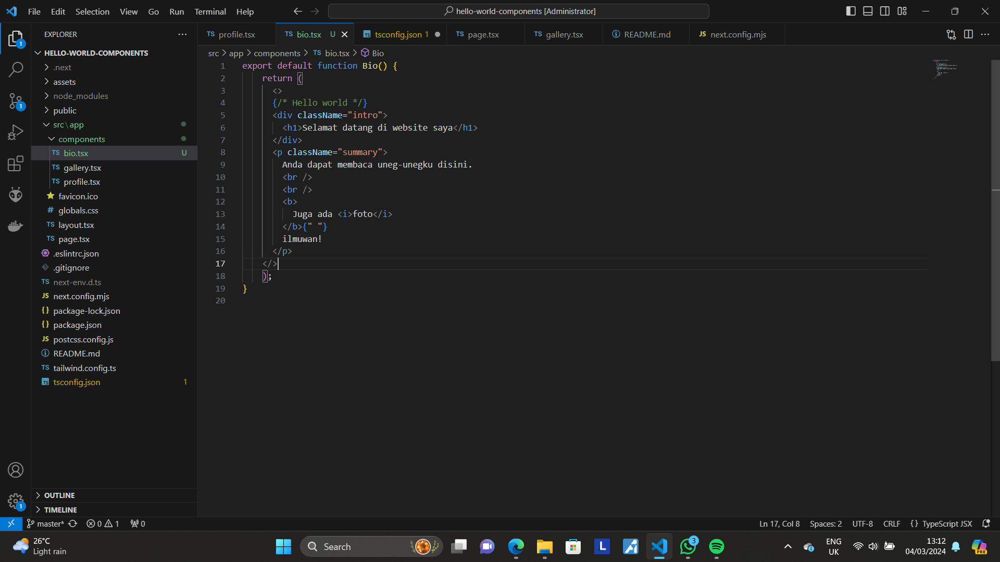
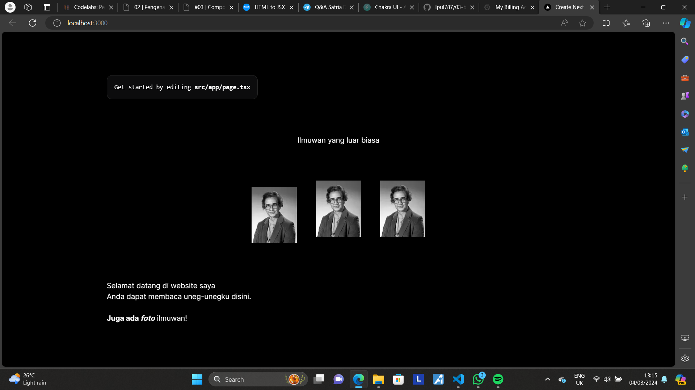
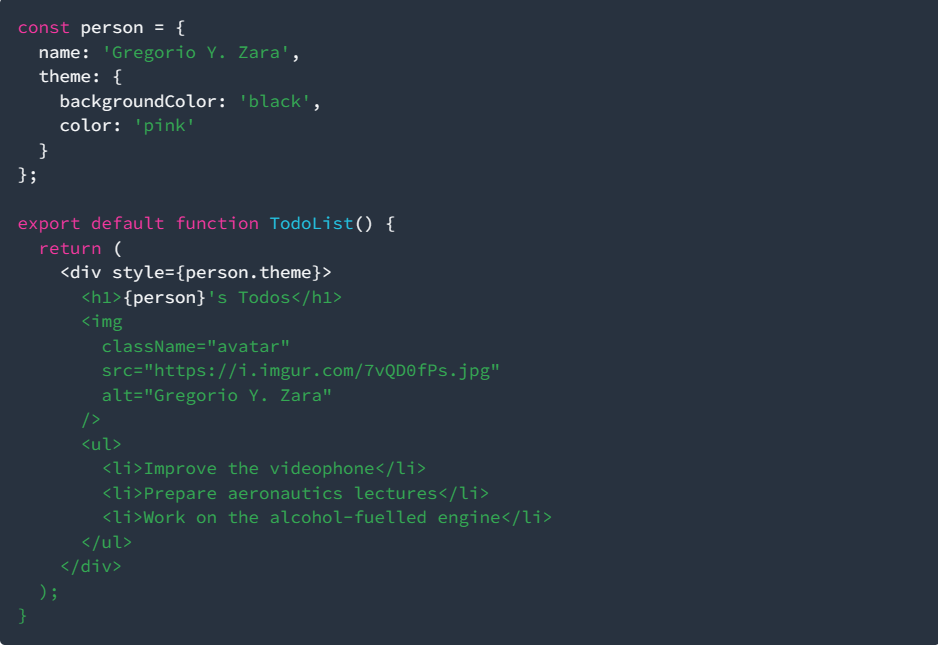
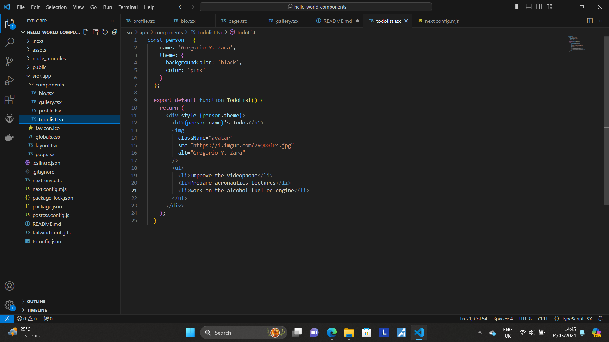

This is a [Next.js](https://nextjs.org/) project bootstrapped with [`create-next-app`](https://github.com/vercel/next.js/tree/canary/packages/create-next-app).

## Getting Started

First, run the development server:

```bash
npm run dev
# or
yarn dev
# or
pnpm dev
# or
bun dev
```

Open [http://localhost:3000](http://localhost:3000) with your browser to see the result.

## Practicum Report

|  | Framework Based Programming 2024 |
|--|--|
| NIM |  2141720067|
| Nama |  Saefulloh Fatah Putra Kyranna |
| Kelas | TI - 3I |

## Answer of Question no. 1

Output: 



There were some error at the beginning, such as not displaying the profile, however we can fix the error by editing the next.config.mjs file to include the image domain. 

Error code: 



Fix that include the image: 



## Answer of Question no. 2

Output: 



The page loads as usual with assets from Gallery component being displayed on the screen. This is because inside the page.tsx there is a function that calls the component from the component folder. 

Source code on page.tsx



## Answer of Question no. 3

Fixed code using converter: 



Here, the code has "ClassName" instead of "Class" because JSX doesn't recognize "Class" as a property. 

Output: 



## Answer of Question no. 4

Output: 



There is a mistake on h1 tag in "person" curly bracket. It was supposed to refer to the person object, but it didn't specify person's attribute. Therefore we can fix it with assigning an attribute to the person. 

Fixed code: 

